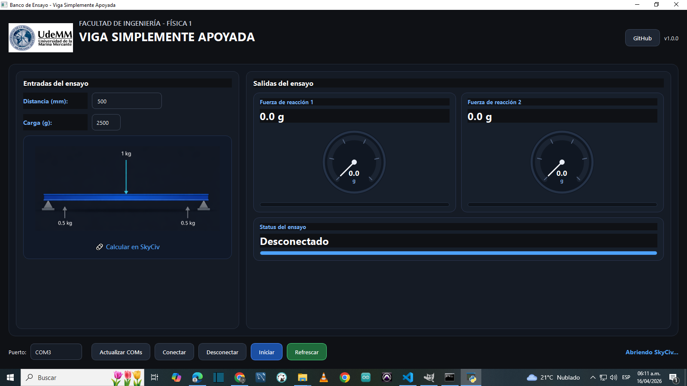

# 🏗️ Banco de Ensayo – Viga Simplemente Apoyada

Aplicación en Python para el control y visualización de un banco de ensayo de una viga simplemente apoyada, desarrollada como herramienta didáctica para laboratorio de Física.

---

## 🎯 Objetivo

Permitir:

- Control del banco de ensayo mediante Arduino
- Visualización en tiempo real de magnitudes físicas
- Interfaz gráfica clara y robusta para laboratorio
- Compatibilidad Windows ↔ Raspberry Pi

---

## 🖥️ Tecnologías utilizadas

- Python 3.11
- PySide6 (GUI)
- PySerial (comunicación serie)
- Arduino (control y adquisición)

---

## 🧩 Arquitectura del proyecto

```text
beam_app/
│
├── main.py
│
├── ui/
│   ├── main_window.py
│   └── graphics.py
│
├── controllers/
│   └── main_controller.py
│
├── core/
│   └── serial_manager.py
│
├── config/
│   └── app_config.py
│
├── assets/
│   └── images/
│       ├── app.png
│       └── udemm_logo.png
│
├── run.bat
├── run.sh
├── requirements.txt
└── README.md
```

---

## Antes de ejecutar la aplicación, asegurarse de tener instalado:

1. **Git (para descargar el código)**
   Descargar desde:
   https://git-scm.com/downloads

2. **Python 3.11**
   Descargar desde:
   https://www.python.org/downloads/

⚠️ Importante durante la instalación de Python:

* Marcar la opción **“Add Python to PATH”**

---

Una vez instalado:

```bat
git clone https://github.com/theinsideshine/beam_app.git
cd beam_app
run_first.bat
run.bat
```

---

Ante cualquier problema, verificar:

* Puerto COM del Arduino
* Cable USB conectado correctamente


## ⚙️ Instalación

### 1. Clonar repositorio

```bash
git clone https://github.com/TU_USUARIO/beam_app.git
cd beam_app
```

---

### 2. Crear entorno virtual

#### Windows

```bash
py -3.11 -m venv .venv
.venv\Scripts\activate
```

#### Linux / Raspberry Pi

```bash
python3 -m venv .venv
source .venv/bin/activate
```

---

### 3. Instalar dependencias

```bash
pip install -r requirements.txt
```

---

## ▶️ Ejecución

### Windows

```bash
run.bat
```

### Linux / Raspberry Pi

```bash
chmod +x run.sh
./run.sh
```

O manual:

```bash
python main.py
```

---

## 🔌 Comunicación con Arduino

La comunicación se realiza vía puerto serie usando **PySerial** y un hilo de lectura dedicado.

### Comandos enviados

```json
{"info":"status"}
{"info":"all-params"}
{"distance":500}
{"force":2500}
{"cmd":"start"}
```

### Respuestas del Arduino

```json
{"info":"status","status":0}

{"info":"all-params",
 "distance":500,
 "force":2500,
 "reaction_one":1250,
 "reaction_two":1250,
 "flexion":2120.082,
 "st_test":0
}

{"cmd":"start","result":"ack"}

{"st_test":0}
```

---

## 🧠 Lógica actual del sistema

### Botón **Refrescar**

1. Envía `{"info":"status"}`
2. Si `status == 0`, envía `{"info":"all-params"}`
3. Actualiza la interfaz con:
   - distancia
   - carga
   - reacción 1
   - reacción 2
   - flexión
   - estado del ensayo

### Botón **Iniciar**

1. Verifica estado con `{"info":"status"}`
2. Si el ensayo está apagado:
   - envía distancia en mm
   - envía carga en g
   - envía `{"cmd":"start"}`
3. La GUI cambia a estado encendido al recibir `ack`
4. Al recibir `{"st_test":0}`, la GUI vuelve a apagado

### Parsing serie

El controlador reconstruye los JSON desde el stream serie, soportando múltiples objetos consecutivos en la misma ráfaga de datos.

---

## 📊 Funcionalidades actuales

- Interfaz gráfica moderna en PySide6
- Conexión y desconexión por puerto serie
- Refresco inteligente de parámetros
- Inicio de ensayo desde GUI
- Visualización de:
  - fuerza de reacción 1
  - fuerza de reacción 2
  - flexión
  - estado del ensayo
- Gauges analógicos configurables
- Auto-actualización del estado al finalizar un ensayo
- Logs de depuración del flujo serie

---

## ⚙️ Configuración

La configuración principal está centralizada en:

```python
config/app_config.py
```

Ejemplos de parámetros configurables:

```python
DEFAULT_DISTANCE = "500"
DEFAULT_LOAD = "2500"

LOAD_OPTIONS = ["0", "500", "1000", "1500", "2000", "2500", "3000", "3500", "4000", "4500", "5000"]

UNIT_FORCE = "g"
UNIT_FLEX = "mm"

REACTION_GAUGE_MIN = 0
REACTION_GAUGE_MAX = 8000
REACTION_GAUGE_INITIAL = 0
```

---

## 🖼️ Captura de la aplicación


---

## 🚧 Estado del proyecto

Base funcional completa:

- ✅ Comunicación estable con Arduino
- ✅ Flujo de refresco operativo
- ✅ Inicio de ensayo desde GUI
- ✅ Parsing robusto de respuestas JSON
- ✅ Visualización del estado del ensayo

Pendiente:

- [ ] Registro de datos a archivo
- [ ] Exportación de resultados
- [ ] Curvas de ensayo
- [ ] Ajustes finales de UX para laboratorio

---


## 🔧 Simulación Arduino

El repositorio incluye un simulador del banco de ensayo desarrollado en Arduino:

```text
flexion_viga_simulacion/

Este módulo permite:

Simular el comportamiento del banco sin hardware real
Probar la comunicación serie desde la aplicación Python
Validar el flujo completo del ensayo
▶️ Uso
Abrir el archivo:
flexion_viga_simulacion/flexion_viga.ino
Compilar y cargar en una placa Arduino
Conectar la aplicación Python al puerto serie correspondiente
📌 Nota

Las librerías utilizadas deben instalarse desde el Arduino IDE (Library Manager) si no están disponibles en el entorno local.


## 🧵 Manejo de comunicación serie (Thread-safe con cola)

Para garantizar estabilidad en la interfaz gráfica (Qt) y evitar errores de concurrencia, la aplicación implementa un modelo productor–consumidor usando una cola FIFO para la comunicación con el Arduino.

---

### 🎯 Problema

El puerto serie se lee en un thread secundario, pero Qt exige que toda la UI se actualice únicamente desde el hilo principal.

Acceder a widgets o timers desde otro hilo puede provocar errores como:

```
QObject::killTimer: Timers cannot be stopped from another thread
QBackingStore::endPaint() called with active painter
```

---

### ✅ Solución adoptada

Se desacopla la lectura serie de la lógica de la UI mediante una cola de eventos.

---

### 🧠 Arquitectura

```
Thread serie (SerialManager)
        ↓
    Cola FIFO (SerialEventQueue)
        ↓
QTimer (Main thread - Qt)
        ↓
MainController.handle_serial_data()
        ↓
Actualización de UI
```

---

### 🔧 Componentes

#### 1. SerialManager (Productor)

- Corre en un thread separado
- Lee datos del puerto serie
- Inserta cada línea en la cola

```python
self.event_queue.put(line)
```

No procesa datos ni accede a la UI.

---

#### 2. SerialEventQueue (Cola FIFO)

- Implementada con queue.Queue
- Garantiza orden de llegada (FIFO)
- Permite desacoplar threads

---

#### 3. MainController (Consumidor)

- Usa un QTimer para consultar la cola periódicamente
- Procesa todos los mensajes pendientes

```python
def _process_serial_queue(self):
    while True:
        try:
            line = self.serial_queue.get_nowait()
            self.handle_serial_data(line)
        except Empty:
            break
```

---

#### 4. QTimer

- Ejecuta _process_serial_queue() cada ~30 ms
- Corre en el hilo principal de Qt
- Garantiza acceso seguro a la UI

---

### 🔁 Flujo de datos

1. El usuario envía un comando (ej: STATUS, START)
2. Arduino responde por serie
3. SerialManager recibe la línea y la coloca en la cola
4. QTimer dispara el consumo
5. MainController procesa el mensaje y actualiza la UI

---

### ⚠️ Reglas importantes

- El thread serie NO debe acceder a la UI
- El thread serie NO debe procesar lógica del protocolo
- Solo el MainController interpreta los datos
- Toda la UI se actualiza en el hilo principal

---

### 🧩 Ventajas

- Evita errores de concurrencia en Qt
- Mantiene la UI estable
- Permite manejar eventos asíncronos del banco
- Escalable para futuros eventos o protocolos más complejos

---

### 💡 Nota

Este enfoque es equivalente al uso de señales (Qt Signals), pero mantiene el SerialManager desacoplado de Qt, facilitando su reutilización en otros entornos.


## 🧠 Contexto académico

Aplicación orientada al estudio de:

- Vigas simplemente apoyadas
- Equilibrio estático
- Reacciones en apoyos
- Flexión y deformación

---

## 🤝 Contribuciones

Proyecto en desarrollo activo.  
Las sugerencias y mejoras son bienvenidas.

---

## 📄 Licencia

Uso académico / educativo.
