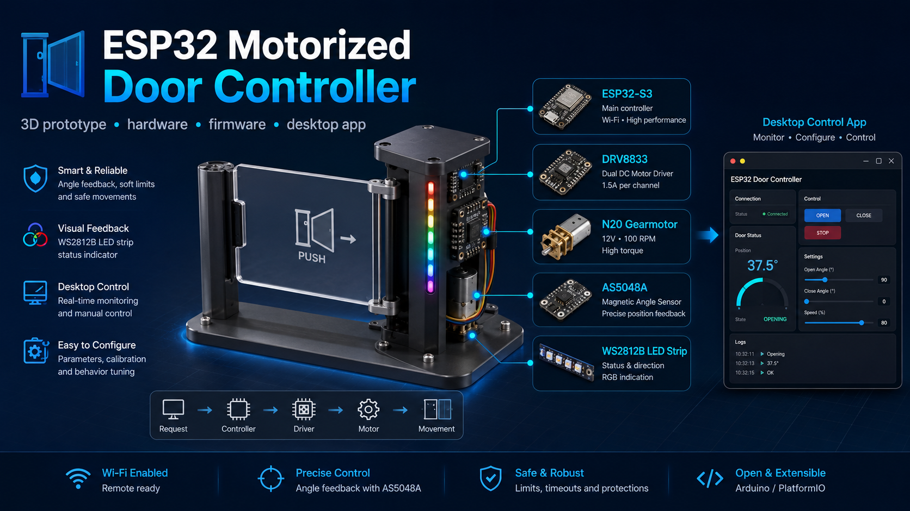
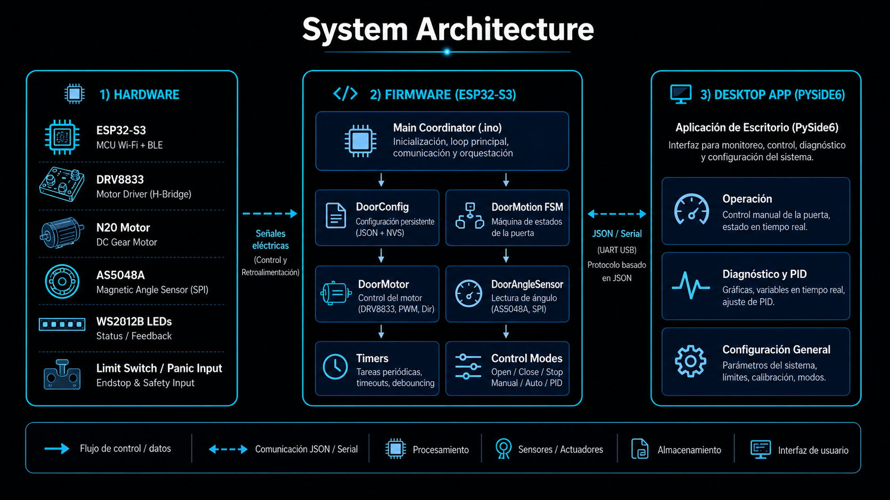
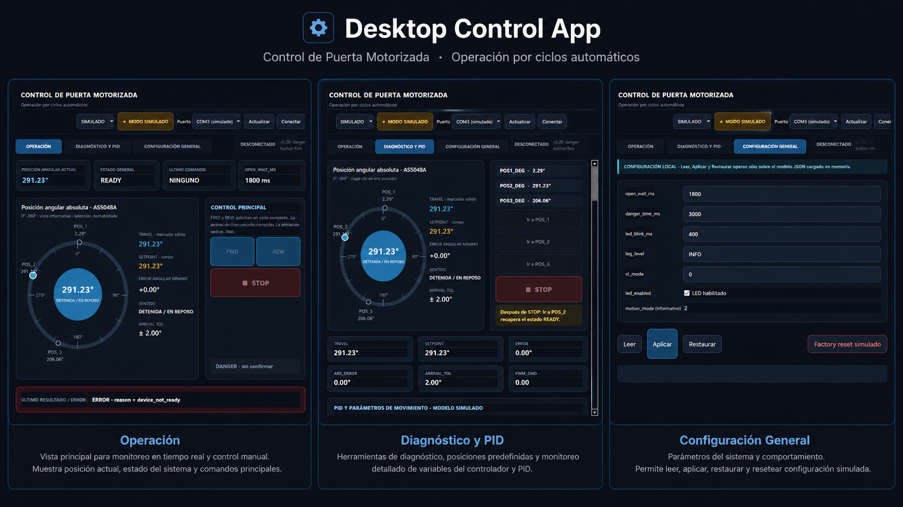
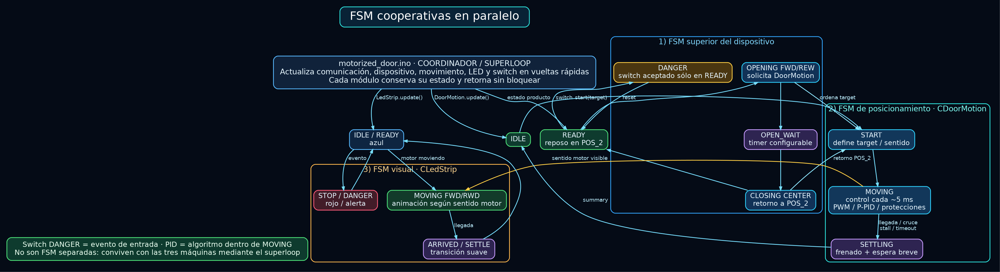
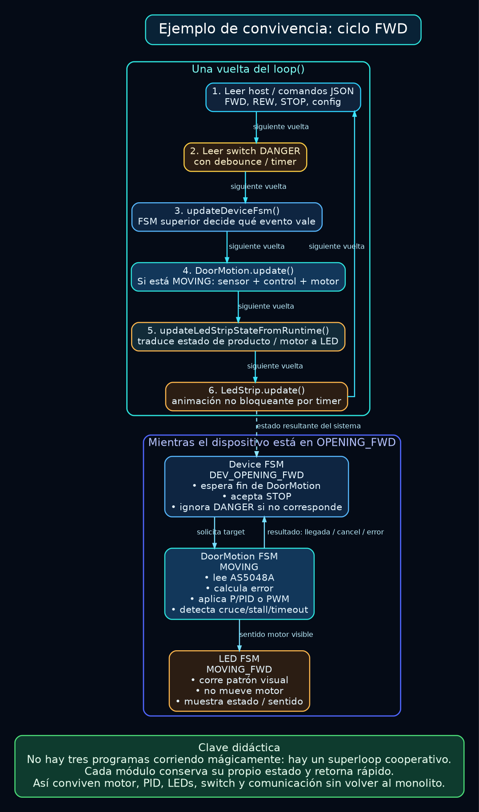
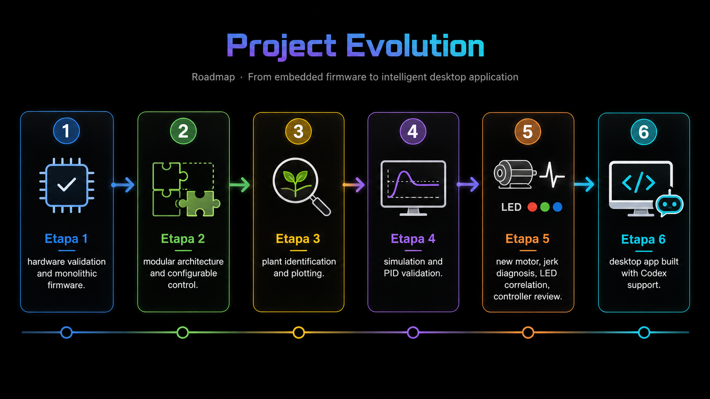

# ESP32 Motorized Door Controller

<p align="center">
  
</p>

> Prototipo funcional a escala de una puerta motorizada de paso, desarrollado como proyecto integrador de I+D para recorrer de forma práctica diseño mecánico, electrónica, firmware embebido, identificación de planta, control y aplicación de escritorio.

---

## 1. Visión del proyecto

Este repositorio documenta la evolución completa de un sistema de control para una **puerta motorizada de paso** basada en ESP32-S3.

El objetivo no fue simplemente lograr que un motor girara hasta una posición. El proyecto se utilizó como un caso de estudio de Ingeniería Electrónica para mostrar cómo una solución real evoluciona mediante:

- diseño CAD e impresión 3D;
- selección e integración de hardware;
- validación experimental;
- firmware monolítico inicial;
- arquitectura modular;
- configuración persistente;
- máquinas de estado;
- instrumentación y Serial Plotter;
- identificación de planta;
- simulación;
- control realimentado;
- diagnóstico de fallas;
- señalización LED;
- aplicación de escritorio.

La idea central es **aprender haciendo**: adquirir conocimientos, aplicarlos sobre un objetivo concreto y convertir las pruebas, errores y decisiones de diseño en competencias profesionales.

---

## 2. Alcance del prototipo

En un desarrollo industrial real se construiría un prototipo funcional representativo del producto final.

A los efectos de este proyecto se implementó un **prototipo funcional a escala**, fabricado principalmente mediante impresión 3D y componentes electrónicos comerciales de bajo costo.

El prototipo permite estudiar el comportamiento del sistema y validar decisiones de arquitectura y control, pero no pretende reproducir todavía:

- dimensiones reales;
- materiales de producción;
- resistencia estructural;
- mecanismos de seguridad certificados;
- embragues o trabas mecánicas de una puerta comercial;
- cargas, inercias y tolerancias de una unidad de tamaño real.

---

## 3. Arquitectura actual

<p align="center">
  
</p>

La arquitectura separa claramente las responsabilidades principales:

### Hardware

- **ESP32-S3 Dev Module**
- **DRV8833** como puente H
- **Motorreductor N20 de 6 V**
- **AS5048A** como sensor absoluto de posición angular por SPI
- **WS2812B** para señalización visual
- entrada de final de carrera / seguridad
- estructura y mecanismos impresos en 3D

### Firmware

El firmware evolucionó desde un único `.ino` experimental hacia una arquitectura modular.

Responsabilidades principales:

- `motorized_door.ino`  
  Coordinación general del dispositivo.

- `door_config.*`  
  Comunicación JSON, parámetros de configuración, persistencia NVS y requests del host.

- `door_motion.*`  
  Máquina de estados de posicionamiento y estrategias de movimiento.

- `door_motor.*`  
  Abstracción del DRV8833, dirección y PWM.

- `door_angle_sensor.*`  
  Lectura del AS5048A.

- logging / instrumentación  
  Salida humana, JSON de estado y datos para Plotter.

Una decisión importante fue mantener separadas:

1. la lógica del producto;
2. la máquina de posicionamiento;
3. el acceso al hardware;
4. la comunicación;
5. la configuración persistente.

Esto permitió modificar estrategias de control sin reescribir todo el sistema.

### Aplicación de escritorio

La aplicación fue desarrollada en **Python + PySide6**, con asistencia de Codex durante la implementación.

La aplicación no replica la lógica del dispositivo: consume el protocolo y los estados expuestos por el firmware.

Dispone de tres áreas principales:

- **Operación**
- **Diagnóstico y PID**
- **Configuración General**

<p align="center">
  
</p>


---

## FSM cooperativas: dispositivo, movimiento y LED

<p align="center">
  
</p>

En la última evolución del firmware apareció un punto clave de arquitectura: el sistema ya no se entiende como una única máquina de estados, sino como **varias máquinas cooperativas** coordinadas desde el `.ino`.

El `loop()` actúa como coordinador. En cada vuelta atiende comunicación, comandos, switch de seguridad, máquina superior del dispositivo, movimiento y animación LED. La regla central es que cada módulo debe **conservar su propio estado y volver rápido**, sin quedarse bloqueando al resto del sistema.

Conviven tres FSM principales:

### 1. FSM superior del dispositivo

Representa el comportamiento del producto completo:

```text
BOOT
CENTERING
READY
OPENING_FWD / OPENING_REW
OPEN_WAIT
CLOSING_CENTER
STOPPED
DANGER
```

Esta FSM decide qué acciones tienen sentido según el estado general. Por ejemplo, el switch o botón de `DANGER` no debe tener el mismo significado durante `READY` que durante una apertura o un retorno al centro.

En esta capa viven las reglas del producto:

- iniciar centrado al arranque;
- quedar operativo en `POS_2`;
- aceptar ciclos `FWD` y `REW`;
- esperar `open_wait_ms`;
- volver al centro;
- atender `STOP`;
- aceptar o ignorar el evento `DANGER` según corresponda.

### 2. FSM de posicionamiento `CDoorMotion`

Esta FSM resuelve el movimiento físico hacia un objetivo:

```text
IDLE
START
MOVING
SETTLING
HOLDING reservado
```

Durante `MOVING` puede usar distintas estrategias de control:

```text
motion_mode = 0  PWM fijo
motion_mode = 1  approach no-PID
motion_mode = 2  control realimentado P/PID según parámetros
```

También concentra criterios de llegada y protección:

- tolerancia;
- cruce del objetivo;
- timeout;
- stall;
- cancelación;
- settle final.

El PID no es una FSM aparte. Es un algoritmo de control que se ejecuta dentro de `MOVING` cuando el modo configurado lo requiere.

### 3. FSM visual `CLedStrip`

La tira WS2812B mantiene su propia lógica temporal:

```text
IDLE / READY
MOVING_FWD
MOVING_RWD
ARRIVED / SETTLE
STOP / DANGER
```

Esta máquina no debe mover el motor ni decidir el estado del producto. Su responsabilidad es representar visualmente el estado que ya fue decidido por las otras capas.

El caso del tironeo del motor mostró por qué esta separación es importante: el LED no provocaba el problema mecánico; estaba mostrando en tiempo real una inversión breve del sentido del motor. Lo que parecía un síntoma visual aislado terminó siendo evidencia de la causa.

<p align="center">
  
</p>

Durante un ciclo `FWD`, por ejemplo, ocurren varias cosas al mismo tiempo desde el punto de vista del usuario, pero no como hilos separados ni como tareas bloqueantes:

```text
Device FSM     : DEV_OPENING_FWD
DoorMotion FSM : MOVING
LED FSM        : MOVING_FWD
Switch DANGER  : leído, pero la FSM superior decide si lo acepta
Comunicación   : sigue disponible para STOP / estado / diagnóstico
```

La conclusión didáctica es importante:

> No hay tres programas corriendo mágicamente. Hay un **superloop cooperativo** donde cada módulo conserva su estado, ejecuta una pequeña parte de su trabajo y devuelve el control.

Esta arquitectura permitió que convivan motor, sensor, PID, LED, switch de seguridad y aplicación desktop sin volver al firmware monolítico inicial.


## 4. Evolución del proyecto

<p align="center">
  
</p>

El proyecto se desarrolló de forma incremental, conservando versiones funcionales como **baseline** antes de introducir cambios de arquitectura o control.

### Etapa 1 — Validación electromecánica y firmware monolítico

Primero se validó lo esencial:

- diseño CAD;
- impresión 3D;
- montaje del N20;
- alineación mecánica;
- prueba directa a 6 V en ambos sentidos;
- transmisión del movimiento hacia la puerta;
- DRV8833;
- AS5048A;
- primer firmware monolítico;
- movimiento manual y automático;
- comportamiento con PWM fijo.

La instrumentación mostró que el ESP32, el SPI y el ciclo de control respondían con margen suficiente.

El problema dominante no estaba en la velocidad de procesamiento: estaba en la **dinámica del mecanismo**.

Se observaron:

- inercia después del corte;
- sobrepaso;
- fricción;
- diferencias según sentido;
- zonas de arranque marginal;
- stalls bajo determinadas cargas.

### Etapa 2 — Arquitectura modular y control configurable

Una vez validada la plataforma física se evitó seguir creciendo sobre el firmware experimental.

Se separaron responsabilidades y se incorporaron:

- configuración JSON;
- persistencia NVS;
- FSM de posicionamiento independiente;
- abstracción del motor;
- abstracción del sensor;
- modos de movimiento configurables.

Se conservaron distintos `motion_mode` para poder comparar estrategias sobre la misma arquitectura.

El modo de PWM fijo quedó como baseline y se agregó un perfil **approach no-PID**, con:

- boost de arranque;
- PWM de movimiento;
- PWM lento;
- zona de aproximación;
- tiempo de boost.

El approach mejoró algunos recorridos y redujo stalls, pero mostró otro problema: cada mejora empírica agregaba nuevos parámetros dependientes de la mecánica.

### Etapa 3 — Identificación de planta

Para dejar de ajustar solamente por prueba y error se instrumentó el sistema con Serial Plotter.

La identificación se realizó con:

```text
motion_mode = 0
PWM fijo = 70, 75 y 80
```

Se registró principalmente:

```text
travel vs tiempo
```

Esto evitó confusiones producidas por el wrap angular `0° / 360°`.

En la zona útil del recorrido el comportamiento resultó aproximadamente lineal.

Modelo inicial:

```text
velocidad_deg_s ≈ 4.97 * (PWM - 18.0)
```

El modelo no pretende reproducir todos los efectos físicos. Su objetivo fue capturar la dinámica dominante y proporcionar una base para simulación.

Un hallazgo relevante fue que PWM 70 podía alcanzar una velocidad normal una vez iniciado el movimiento, pero presentar un retardo de arranque importante en determinada condición. Esto separó claramente:

- dinámica en régimen;
- fricción estática / zona muerta de arranque.

### Etapa 4 — Simulación y control realimentado

Antes de modificar nuevamente el firmware se simuló la planta en Python.

La estrategia fue:

```text
planta medida
    ↓
modelo
    ↓
simulación
    ↓
constantes iniciales
    ↓
hardware real
    ↓
recalibración
```

La simulación entregó una base conservadora cercana al comportamiento real.

Una primera implementación utilizó valores próximos a:

```text
Kp = 0.70
Ki = 0
Kd = 0.05
PWM max = 80
```

En el banco real fue necesario corregir principalmente las zonas que el modelo simple no representaba:

- fricción;
- PWM mínimo efectivo;
- arranque;
- carga;
- comportamiento muy próximo al target.

Durante esa etapa también se evaluó una integral pequeña y limitada para corregir error fino.

El aprendizaje importante fue que **la simulación no reemplaza al hardware**. Sirve para reducir el espacio de búsqueda y comenzar los ensayos físicos con valores razonables.

> **El controlador se sintonizó con relativa facilidad porque antes se había realizado el trabajo de identificación de planta, simulación y conservación de un baseline.**

En un producto real existirían motor, eje, embrague, puerta, rodamientos, tolerancias de fabricación y múltiples piezas. Cada unidad modifica ligeramente la planta. Una práctica razonable sería caracterizar una población de equipos, obtener una planta representativa y luego realizar una calibración homogénea con márgenes adecuados.

### Etapa 5 — Motor nuevo, tironeo, LED y revisión del controlador

Durante la integración de la tira WS2812B fue necesario reemplazar el motor N20.

En ese momento aparecieron simultáneamente dos síntomas:

- un tironeo mecánico;
- un salto visual en la animación LED.

El firmware todavía estaba en evolución, por lo que fue necesario evitar conclusiones rápidas.

Se utilizaron las capacidades construidas en etapas anteriores:

- modos de ejecución;
- simulación del movimiento LED;
- PWM fijo;
- Plotter;
- parámetros configurables;
- separación entre motor, LED y máquina de movimiento.

Esto permitió aislar progresivamente el problema.

El análisis mostró que el término derivativo estaba produciendo breves inversiones de la salida de control. El puente H obedecía esas inversiones y el motor cambiaba momentáneamente de sentido.

La animación LED consultaba el mismo estado de dirección del motor.

Por lo tanto:

> El LED no provocaba el tironeo.  
> El tironeo y el salto visual eran dos manifestaciones de la misma inversión breve de sentido.

La observación que inicialmente parecía un segundo error terminó convirtiéndose en evidencia independiente de la causa.

La configuración operativa se simplificó posteriormente a:

```text
pid_kp = 0.70
pid_ki = 0
pid_kd = 0
```

Aunque históricamente el proyecto recorrió PD y PID, en esta planta y en este prototipo no fue necesario conservar los términos I y D para obtener el comportamiento deseado.

Esta etapa confirmó otra conclusión importante:

> **Una arquitectura escalable, configurable y con modos de prueba no es solamente una cuestión de prolijidad de software: es una herramienta de diagnóstico de I+D.**

### Etapa 6 — Aplicación de escritorio

Con el firmware y el protocolo ya consolidados se desarrolló la aplicación de escritorio.

Tecnología:

```text
Python
PySide6
JSON / Serial
```

La implementación se realizó de manera incremental con asistencia de Codex, pero manteniendo una separación clara de responsabilidades:

- el firmware conserva la autoridad sobre el dispositivo;
- la app muestra y solicita;
- los estados reales se obtienen del protocolo;
- las decisiones de arquitectura y los criterios de validación pertenecen al proceso de ingeniería.

La interfaz incluye:

#### Operación

- posición angular actual;
- estado general;
- último comando;
- tiempo de espera de apertura;
- representación angular del AS5048A;
- comandos `FWD`, `REW` y `STOP`;
- visualización de estado y errores.

#### Diagnóstico y PID

- POS_1 / POS_2 / POS_3;
- `travel`;
- `setpoint`;
- error angular;
- error absoluto;
- tolerancia;
- `pwm_cmd`;
- parámetros de movimiento/control;
- comandos de posicionamiento para diagnóstico.

#### Configuración General

- `open_wait_ms`;
- `danger_time_ms`;
- `led_blink_ms`;
- `log_level`;
- `st_mode`;
- `led_enabled`;
- información de `motion_mode`;
- lectura, aplicación y restauración de configuración.

La aplicación incluye además un **modo simulado**, útil para desarrollar y validar la interfaz sin depender permanentemente del hardware conectado.

---

## 5. Estado funcional actual

El prototipo evolucionó desde un posicionador experimental hacia una máquina de dispositivo.

La operación normal tiene como posición de reposo:

```text
POS_2
```

La lógica superior permite solicitar ciclos hacia ambos lados mediante:

```text
FWD
REW
STOP
```

Conceptualmente, un ciclo de apertura realiza:

```text
READY
  ↓
apertura hacia un extremo
  ↓
espera configurable
  ↓
retorno a POS_2
  ↓
READY
```

Al iniciar el dispositivo se busca llevar la puerta a la posición central de referencia antes de habilitar la operación normal.

La señalización LED se integra con los estados de movimiento y seguridad sin bloquear la ejecución principal.

---

## 6. Hardware de referencia

| Componente | Uso |
|---|---|
| ESP32-S3 Dev Module | Controlador principal |
| DRV8833 | Puente H / accionamiento del motor |
| N20 6 V con reductora | Actuador del prototipo |
| AS5048A | Sensor absoluto de posición angular |
| WS2812B | Indicadores visuales |
| Final de carrera / entrada de seguridad | Referencia y protección |
| Piezas impresas en 3D | Estructura y transmisión mecánica |

### Pines usados

```text
DRV8833 STBY : GPIO4
DRV8833 AIN2 : GPIO16
DRV8833 AIN1 : GPIO17

AS5048A CS   : GPIO10
AS5048A MOSI : GPIO11
AS5048A SCK  : GPIO12
AS5048A MISO : GPIO13

FC_L         : GPIO14
WS2812B      : GPIO6
```

---

## 7. Posiciones calibradas del prototipo

```text
POS_1 =   2.29°
POS_2 = 291.23°
POS_3 = 206.06°
```

El sistema trabaja con un sensor absoluto `0°–360°`, por lo que el firmware debe contemplar correctamente el **wrap angular**.

Ejemplo:

```text
posición = 358°
target   =   2°
```

La distancia angular correcta no es `-356°`, sino `+4°` por el recorrido corto.

---

## 8. Conceptos de control implementados o estudiados

Durante el desarrollo se trabajó con:

- PWM fijo;
- zona muerta;
- PWM mínimo efectivo;
- boost de arranque;
- zona lenta;
- error angular;
- tolerancia de llegada;
- cruce del target;
- stall;
- timeout;
- settle;
- control P;
- control PD;
- control PID;
- saturación;
- integral limitada;
- identificación de planta;
- simulación;
- realimentación absoluta.

El objetivo no fue demostrar que un PID siempre sea necesario.

El proyecto muestra justamente lo contrario: **el controlador debe responder a la planta real y al objetivo de producto**.

La evolución PD/PID fue técnicamente útil porque permitió estudiar la dinámica y encontrar una solución robusta. La evidencia posterior llevó a simplificar el controlador operativo.

---

## 9. Limitaciones mecánicas del prototipo

El N20 utilizado es apropiado para un prototipo pequeño, pero debe respetarse su naturaleza mecánica.

Estos motorreductores se utilizan normalmente para transmitir torque mediante:

- ruedas;
- engranajes;
- poleas;
- acoples alineados.

No están pensados para recibir esfuerzos axiales o laterales importantes directamente sobre su eje.

Durante el proyecto se observó que las cargas externas y los montajes experimentales pueden introducir:

- palanca sobre el eje;
- esfuerzos laterales;
- rozamiento variable;
- juego en la reductora;
- condiciones que no representan el producto final.

Por este motivo las pruebas actuales evitan aplicar cargas laterales arbitrarias sobre el eje.

En un equipo comercial deberían utilizarse mecanismos adecuados de:

- eje;
- soporte;
- rodamientos;
- acople;
- embrague;
- traba o mecanismo de liberación.

---

## 10. Seguridad y HOLDING

El proyecto diferencia **posicionamiento** de **seguridad mecánica**.

Un controlador puede mantener o corregir una posición, pero una puerta real destinada al paso de personas no debería depender únicamente del torque del motor o de un PID para bloquear un acceso.

Un producto real debería evaluar elementos como:

- embrague;
- traba;
- solenoide;
- liberación ante fuerza externa;
- detección de obstrucción;
- límites de torque;
- condiciones de emergencia.

Por esta razón el concepto de `HOLDING` activo se mantuvo reservado durante la etapa de posicionamiento del prototipo.

---

## 11. Protocolo y configuración

El firmware expone información y configuración mediante JSON.

Ejemplos de operaciones utilizadas durante el desarrollo:

```json
{"info":"version"}
```

```json
{"info":"all-params"}
```

```json
{"cmd":"go","pos":1}
```

```json
{"cmd":"fwd"}
```

```json
{"cmd":"rew"}
```

```json
{"cmd":"stop"}
```

La configuración persistente permite recalibrar parámetros sin modificar ni recompilar la arquitectura.

---

## 12. Estructura del repositorio

La estructura puede variar entre branches históricos, pero conceptualmente el repositorio contiene:

```text
esp32-motorized-door-controller/
├── firmware/
│   ├── ...
│   └── beam_app/
├── doc/
│   ├── conceptos de control/
│   ├── etapa1/
│   ├── etapa2/
│   ├── etapa3/
│   ├── etapa4/
│   ├── etapa5/
│   ├── etapa6/
│   ├── fsm/
│   ├── conclusiones.pptx
│   └── puerta_motorizada_estrategia_desarrollo_v01.pdf
├── images/
│   ├── uno.png
│   ├── dos.png
│   ├── tres.png
│   ├── cuatro.png
│   ├── cinco.png
│   └── seis.png
└── README.md
```

## 13. Documentación del proyecto y serie de videos

La documentación fue separada en capítulos para conservar el razonamiento, las pruebas y la evidencia de cada decisión.

La idea es acompañar cada bloque documental con un video. Los enlaces que aparecen a continuación son **marcadores temporales**: cuando los videos estén publicados, solo será necesario reemplazar cada URL por el vínculo definitivo.

> La serie completa recorre el proyecto desde la presentación inicial hasta las conclusiones. No busca condensar todo en un único video: cada etapa conserva su propio contexto, ensayos, errores y decisiones.

**Playlist completa:**  
[ESP32 Motorized Door Controller — Serie de videos](https://www.youtube.com/playlist?list=PLGqY9vY1gnuE)

| Capítulo | Documentación | Video |
|---|---|---|
| Presentación general | [Estrategia de desarrollo](doc/puerta_motorizada_estrategia_desarrollo_v01.pdf) | [Video — Presentación](https://youtu.be/tGlV2I14xzM?si=gqTcPS8floOHWkKc) |
| Conceptos de control | [Material de conceptos](doc/conceptos%20de%20control/) | [Video — Conceptos de control](https://youtu.be/PENDIENTE_CONCEPTOS_CONTROL) |
| Etapa 1 | [Documentación Etapa 1](doc/etapa1/) | [Video — Etapa 1](https://youtu.be/AiCed6doYCs?si=erTG39RUByldZ4Nc) |
| Etapa 2 | [Documentación Etapa 2](doc/etapa2/) | [Video — Etapa 2](https://youtu.be/_OtV3IECt6k?si=y8wfF_4OTmgoHx5V) |
| Etapa 3 | [Documentación Etapa 3](doc/etapa3/) | [Video — Etapa 3](https://youtu.be/PENDIENTE_ETAPA_3) |
| Etapa 4 | [Documentación Etapa 4](doc/etapa4/) | [Video — Etapa 4](https://youtu.be/PENDIENTE_ETAPA_4) |
| Etapa 5 | [Documentación Etapa 5](doc/etapa5/) | [Video — Etapa 5](https://youtu.be/PENDIENTE_ETAPA_5) |
| Etapa 6 | [Documentación Etapa 6](doc/etapa6/) | [Video — Etapa 6](https://youtu.be/PENDIENTE_ETAPA_6) |
| FSM cooperativas | [Documentación FSM](doc/fsm/) | [Video — FSM](https://youtu.be/PENDIENTE_FSM) |
| Conclusiones | [Presentación de conclusiones](doc/conclusiones.pptx) | [Video — Conclusiones](https://youtu.be/PENDIENTE_CONCLUSIONES)<br>[Demo final del proyecto](https://youtu.be/0kEP7_TdRBw) |

### Presentación general

**Marco, objetivo y estrategia de desarrollo**

Introduce el problema, el alcance del prototipo y la forma en que se planteó el trabajo como proyecto integrador de Ingeniería Electrónica e I+D.

El documento de referencia es:

```text
doc/puerta_motorizada_estrategia_desarrollo_v01.pdf


### Conceptos de control

Material introductorio para:

- posición y error;
- tolerancia;
- cruce;
- stall;
- timeout;
- wrap `0° / 360°`;
- planta;
- simulación;
- P / I / D;
- saturación y anti-windup.

### Etapa 1

**Validación inicial de hardware y plataforma electromecánica**

Desde CAD y montaje hasta el primer firmware monolítico y las pruebas con PWM fijo.

### Etapa 2

**Arquitectura modular y control configurable**

Separación de responsabilidades, JSON, NVS, FSM y perfil approach no-PID.

### Etapa 3

**Identificación de planta**

Serial Plotter, curvas `travel/tiempo`, velocidad y modelo inicial.

### Etapa 4

**Simulación y validación del controlador**

Del modelo Python al hardware y pruebas de carga.

### Etapa 5

**Caso de estudio: motor nuevo, tironeo y LED**

Investigación de una anomalía, aislamiento de variables y revisión de la acción derivativa.

### Etapa 6

**Aplicación desktop**

Interfaz de operación, diagnóstico, configuración y modo simulado.

### FSM cooperativas

**Dispositivo, posicionamiento y señalización visual**

Este capítulo concentra la evolución final de la arquitectura hacia varias máquinas de estado cooperativas:

- FSM superior del dispositivo;
- FSM de posicionamiento `CDoorMotion`;
- FSM visual `CLedStrip`;
- coordinación mediante superloop;
- convivencia con comunicación, sensor, PID y eventos de seguridad.

La documentación específica se encuentra en:

```text
doc/fsm/
```

### Conclusiones

**Cierre del prototipo y próximas etapas**

El cierre resume lo aprendido durante todo el recorrido y deja explícito que el prototipo actual no representa el final de un desarrollo profesional.

Entre las etapas futuras quedan:

- decidir el tratamiento definitivo de la acción derivativa;
- corregir comportamientos pendientes de desconexión de la app;
- construir un prototipo a escala real;
- verificar nuevamente la planta y el controlador sobre esa mecánica;
- evaluar el BOM del prototipo real;
- estudiar embrague y mecanismos de liberación;
- estudiar solenoides o trabas para bloqueo mecánico cuando el producto lo requiera;
- diseñar y validar el nuevo hardware de control;
- avanzar desde un prototipo funcional hacia criterios reales de fabricación y producción.

La presentación de cierre se encuentra en:

```text
doc/conclusiones.pptx
```

---

## 14. Decisiones de ingeniería destacadas

El proyecto fue construido alrededor de algunas reglas simples:

### Validar antes de abstraer

El primer firmware fue deliberadamente directo. Su función era demostrar que el hardware y la mecánica podían funcionar.

La modularización se realizó cuando las responsabilidades ya eran suficientemente conocidas.

### Conservar baselines

Cada cambio importante parte de una versión funcional conocida.

Esto permite diferenciar:

```text
problema nuevo
```

de:

```text
problema que ya existía
```

### Instrumentar antes de suponer

Cuando apareció sobrepaso, se midieron tiempos.

Cuando apareció comportamiento extraño, se usó Plotter.

Cuando apareció el tironeo, se aislaron LED, motor, PWM y controlador.

### Una observación no es todavía una causa

El salto visual del LED parecía estar relacionado con el tironeo.

Finalmente se comprobó que ambos eran efectos de una tercera causa común: el cambio momentáneo de sentido ordenado al motor.

### La experiencia guía qué medir

Los datos no seleccionan por sí solos el siguiente ensayo.

El proceso real fue:

```text
observar
   ↓
interpretar
   ↓
formular hipótesis
   ↓
medir
   ↓
decidir
```

---

## 15. Valor didáctico

El proyecto integra competencias de distintas áreas de Ingeniería Electrónica:

- sistemas de representación y CAD;
- fabricación 3D;
- electrónica;
- electrónica de potencia;
- microcontroladores;
- programación;
- programación avanzada;
- arquitectura de software;
- automatización;
- sistemas de control;
- instrumentación;
- análisis experimental;
- proyecto final e I+D.

Más que presentar una solución única, el repositorio documenta **un camino posible**.

La intención es que el estudiante pueda observar cómo los conocimientos adquiridos durante la carrera se combinan cuando aparece un problema real y cómo la experiencia técnica permite elegir qué hipótesis probar, qué variable medir y cuándo una decisión debe revisarse.

---

## 16. Estado actual resumido

```text
Diseño CAD / impresión 3D        : validado para prototipo
Hardware base                    : validado
ESP32-S3 + DRV8833               : operativo
AS5048A                           : operativo
WS2812B                           : integrado
Firmware modular                 : operativo
Configuración JSON               : operativa
Persistencia NVS                 : operativa
FSM de posicionamiento           : operativa
FSM de dispositivo               : integrada
Identificación de planta         : realizada
Simulación                       : realizada
Control realimentado             : validado
Configuración operativa actual   : Kp=0.70, Ki=0, Kd=0
App PySide6                      : integrada / en validación
Modo simulado de app             : disponible
Documentación por etapas         : disponible
```

---

## 17. Próximas validaciones

Entre las pruebas útiles pendientes queda una especialmente interesante para cerrar el vínculo entre modelo y planta:

1. utilizar un PWM no empleado en la identificación original;
2. predecir velocidad con el modelo;
3. medir la velocidad real;
4. comparar predicción y ensayo.

Por ejemplo:

```text
PWM = 77
```

permitiría comprobar si el modelo identificado a partir de PWM 70, 75 y 80 conserva capacidad predictiva sobre un punto intermedio no utilizado para obtener la recta.

También queda abierta la validación del comportamiento completo de la aplicación contra el hardware real y la evolución de los elementos mecánicos hacia una plataforma más representativa del producto comercial.

---

## 18. Idea final

Este proyecto comenzó con una pregunta simple:

> **¿Podemos mover una puerta?**

La evolución llevó a preguntas mucho más interesantes:

> ¿Podemos medirla?  
> ¿Podemos explicar por qué se mueve así?  
> ¿Podemos controlar su comportamiento?  
> ¿Podemos diagnosticar una anomalía sin romper lo que ya funciona?  
> ¿Podemos construir una arquitectura que permita seguir evolucionando?

Ese recorrido es, en definitiva, el objetivo principal del proyecto.